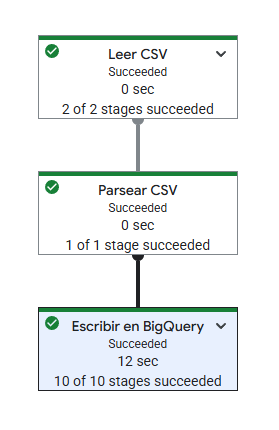
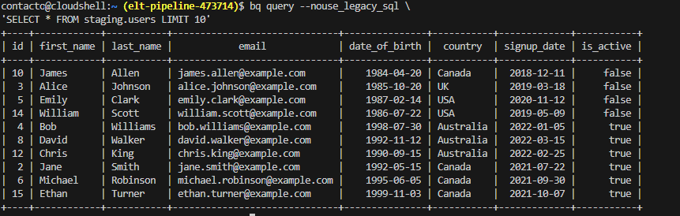
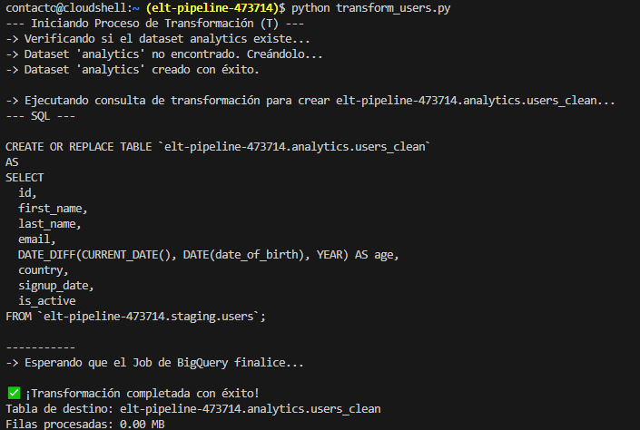
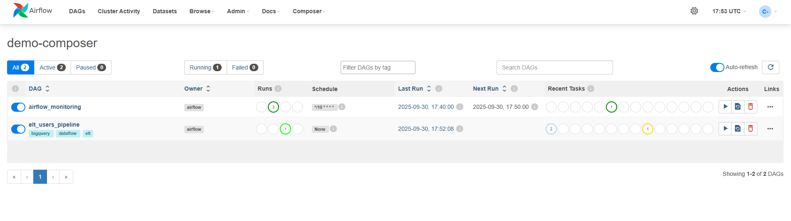

# Pipeline ELT (Extract, Load, Transform) de Datos de Usuarios

Este proyecto implementa un flujo de trabajo de procesamiento de datos **ELT (Extract, Load, Transform)** completamente automatizado en Google Cloud Platform, utilizando Cloud Storage, Dataflow, BigQuery y Cloud Composer para la orquestación.

El objetivo es ingestar datos brutos de usuarios (`users.csv`), cargarlos en BigQuery, transformarlos para calcular métricas clave (como la edad), y dejarlos listos para su análisis en Looker.

---

## 1. Arquitectura del Pipeline

| **Paso**                 | **Tecnología**               | **Archivo Clave**     | **Descripción**                                                                                                     |
| :----------------------- | :--------------------------- | :-------------------- | :------------------------------------------------------------------------------------------------------------------ |
| **E/L** (Extract & Load) | **Dataflow (Apache Beam)**   | `dataflow_users.py`   | Lee el CSV de Cloud Storage y lo carga sin procesar en la tabla de _staging_ de BigQuery.                           |
| **T** (Transform)        | **BigQuery SQL**             | `transform_users.py`  | Ejecuta una consulta SQL para aplicar lógica de negocio (cálculo de edad) y mover los datos a la tabla de análisis. |
| **Orquestación**         | **Cloud Composer (Airflow)** | `elt_pipeline_dag.py` | Automatiza y secuencia la ejecución de los pasos de Dataflow y BigQuery.                                            |
| **Visualización**        | **Looker**                   | N/A                   | Conectado a la tabla final para generar _dashboards_ analíticos.                                                    |

---

## 2. Flujo de Trabajo Detallado

### Fase 1: Ingesta y Carga (Dataflow)

El script `dataflow_users.py` ejecuta el _pipeline_ de Apache Beam para el paso de Extracción y Carga (`EL`):

1. **Fuente de Datos:** Lee el archivo `users.csv` ubicado en Cloud Storage (`gs://elt-demo-bucket/users.csv`).
2. **Destino (Staging):** Carga los datos en la tabla `elt-pipeline-473714.staging.users`.

### Fase 2: Transformación (BigQuery SQL)

Una vez que Dataflow ha cargado los datos en la capa de _staging_, la tarea de transformación ejecuta el paso (`T`):

1. **Origen:** Lee de la tabla de _staging_ (`staging.users`).
2. **Lógica de Negocio:** Calcula la **`age`** (Edad) utilizando la función `DATE_DIFF` y la columna `date_of_birth`.
3. **Destino (Análisis):** Crea o reemplaza la tabla `elt-pipeline-473714.analytics.users_clean`.

### Fase 3: Automatización y Orquestación (Cloud Composer)

El archivo `elt_pipeline_dag.py` define el DAG de Airflow que garantiza que el flujo se ejecute de manera confiable y secuencial:

1. `run_dataflow_el_step` (Bash Operator): Inicia el Job de Dataflow.
2. `transform_data_to_analytics` (BigQueryInsertJobOperator): Ejecuta el SQL de transformación.
3. `cleanup_cloud_storage_temp` (Bash Operator): Limpia el bucket temporal.

---

## 3. Reporte y Visualización (Looker)

Los datos listos para el análisis se encuentran en la tabla:

**Tabla de Origen para Looker:** `elt-pipeline-473714.analytics.users_clean`

Un informe de **Looker** ha sido creado y conectado a esta tabla para visualizar métricas clave.

**Link del Reporte en Looker:**
[[LOOKER](https://lookerstudio.google.com/reporting/85a2c1ae-747c-4d71-bcba-a68807c94c32)]

---

## 4. Archivos del Proyecto y Referencias de Configuración

| **Archivo**           | **Función**                                                  |
| :-------------------- | :----------------------------------------------------------- |
| `users.csv`           | Mock data de usuarios (fuente de datos).                     |
| `dataflow_users.py`   | Script de Apache Beam para la ingesta (E/L).                 |
| `transform_users.py`  | Script para ejecución manual del paso T (BigQuery SQL).      |
| `elt_pipeline_dag.py` | Definición del flujo de trabajo de Airflow (Automatización). |
